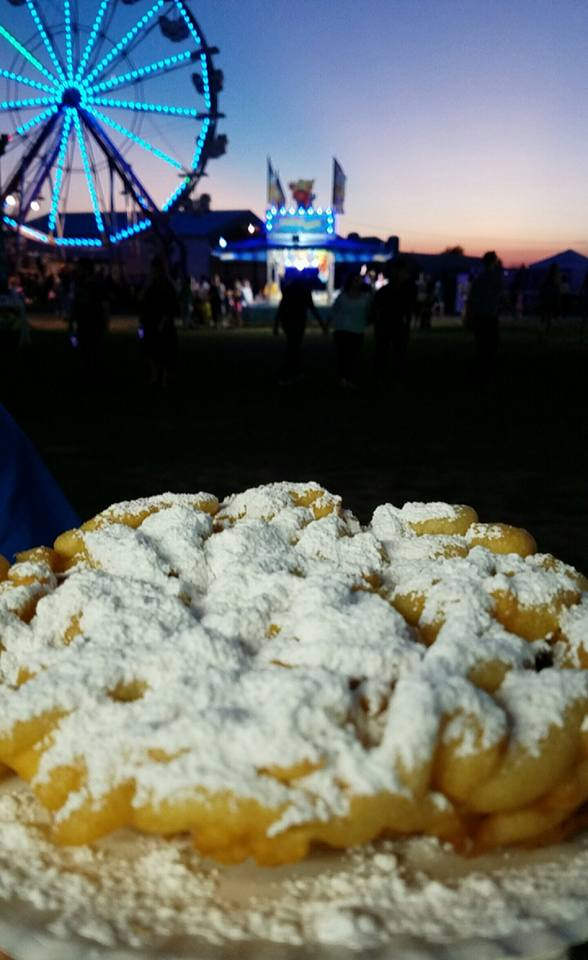

HoughArt is a program designed to create artwork using the Hough Transform. Given a source image, 
it calculates the transform per channel and writes the results to an output file. Several options 
are included for customizing the results.

**Example Input:**



**Example Output:**


# Compilation:
There are a few options for compilation:
  
1) Using CMake. The basic usage is:
  
```bash
  cd [projectRoot]/build
  cmake [-g ...] ..
  make
```

This will produce a binary (`hough_art`) in the 'build' directory.
  
2) Manual compilation. The source files are in [projectRoot/src]. The associated header files 
are in [projectRoot/include]. The user must make sure that DevIL is properly linked.

3) A Netbeans project is also included, which has been set up to simplify development 
   (including calling cmake).
  
## Dependencies:
  - DevIL - used for loading/saving images
  - cmake - (optional) used for generating platform-independent makefiles
  
On Ubuntu (or similar),
```bash
sudo apt-get install libdevil-dev cmake
```

On Windows,
Install both DevIL and CMake. Make sure that cmake knows where to find the DevIL
installation directory.

# Documentation:
  The first argument is required. It is the name/location of the file to be used for input. 
  If the -d flag is set, the first argument specifies the directory containing the input files
  instead. All other arguments have both a command and an associated argument of their own. 
  The options are as follows:
  
  -o : Specify the name and location of the output file. DevIL supports many different extensions, 
       including .png and .jpg. The default value is "../images/output.png". If the -d flag is set,
	   This parameter specifies the directory at which the resulting files will be saved. The
	   filename will be the same as the input filename.
	   
  -d : Flag - Enable directory processing. All files in the input directory will be processed
       and written to the output directory with the same filename.
	   
  -w : Specify the width of the output image in pixels. The default value is 320.
  
  -h : Specify the height of the output image in pixels. The default value is 160.
  
  -c : Specify which channel of the original input image is used in the Hough calculation. 
       c = 0 corresponds to the red channel, c = 1 corresponds to the green channel, and 
       c = 2 cooresponds to the blue channel. If c = -1, all channels will be used, and the 
       results will be superimposed upon one another.

  -n : Specify the number of threads to be used for acceleration. The default value is 0, meaning
       if the host processor has N cores, N threads will be spawned. Generally speaking, more
       threads will reduce the amount of computation time.

  -C : Specify the contrast (values range from 1 to 255). The larger the value, the fewer "lines" 
       will be kept by the Hough algorithm, resulting in a darker image overall. See the examples 
       in images/contrast for some example images. Note that this is different than adjusting
       the gamma value (-g). The contrast setting will change the number of lines, while the
       gamma value will actually adjust the brightness of the image.
  
  -g : Specify the amount of gamma correction that is performed. Values larger than 1.0 will
       brighten the image, and values less than 1.0 will darken it. 1.0 is the default value.
       See the examples in images/gamma for some example images.

  -m : Specify the minimum angle (in degrees) used in the algorithm. The default value is 0.0.
  
  -M : Specify the maximum angle (in degrees) used in the algorithm. The default value is 180.0.
  
  -y : Specify the minimum y coordinate of the original image. This is used to effectively crop the 
       transform. The default value is 0.
  
  -Y : Specify the maximum y coordinate of the original image. This is used to effectively crop 
       the transform. The default value is 0, signifying that the entire image should be used.
  
## Example usage:
```bash
houghart input.jpg -o output.png -w 1024 -h 768 -C 64
```

	
